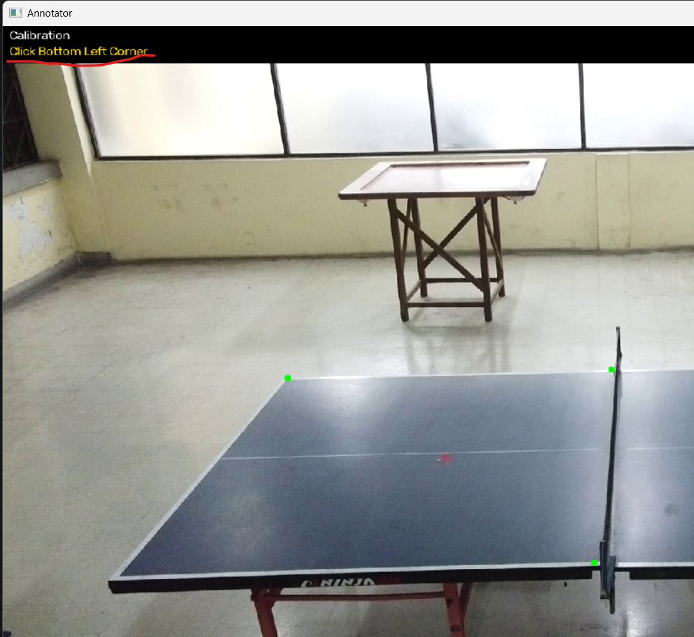
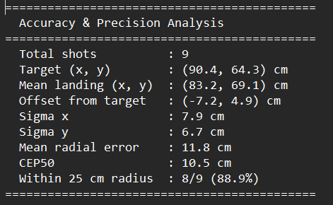

# Table Tennis Ball Landing Annotator

A pair of Python tools for collecting and analysing ball landing data from table tennis ball machine videos.

- **`annotator.py`** — watch a video and click where each ball lands. Saves landing positions to a CSV file.
- **`analyse.py`** — reads the CSV and produces scatter plots, heatmaps, and accuracy statistics.


## Requirements

- Python 3.x
- The following Python packages:

```
pip install opencv-python numpy matplotlib scipy
```

## Usage

### 1. Annotator

Step-1: Open annotator.py

Step-2: Calibration

When the script starts, a file picker opens. Select your video file (`.mp4`, `.avi`, `.mov`, `.mkv`).

The first frame of the video will appear. You must click the **4 corners of the opponent's half of the table** in this exact order:

```
1. Top Left
2. Top Right
3. Bottom Right
4. Bottom Left
```

Then click the **target point** — the spot on the table the ball machine was aimed at.

When the screen shows **"Calibration Complete — Press SPACE"**, press Space to begin annotation.

> ⚠️ Click the corners as precisely as possible — this affects the accuracy of all measurements.


Step-3: Annotation

The video restarts from the beginning and is paused. For each shot:

1. Press **Space** to play.
2. When you see a ball land, press **Space** to pause.
3. Step frame by frame with **A** (back) and **D** (forward) to find the exact bounce frame.
4. **Left click** on the landing spot.
5. The shot counter in the top bar will increment, confirming the click was recorded.

#### Controls

| Key / Action | Description |
|---|---|
| `Space` | Play / Pause |
| `A` | Previous frame |
| `D` | Next frame |
| `Left Click` | Record bounce location |
| `R` | Undo last annotation |
| `Q` | Quit |

#### Output

A CSV file is saved automatically in the **same folder as the video**, named after the video file:

```
your_video_name_annotations.csv
```

Data is saved on every click — no manual saving required.

#### CSV Format

| Column | Description |
|---|---|
| `Shot` | Shot number |
| `Frame` | Video frame number of the annotation |
| `TargetX_cm` | Target x position in cm |
| `TargetY_cm` | Target y position in cm |
| `LandingX_cm` | Landing x position in cm |
| `LandingY_cm` | Landing y position in cm |


### 2. Analyser

Step-1: Open analyse.py

Step-2: A file picker opens — select the `_annotations.csv` file produced by `annotator.py`.

The script runs automatically and saves three output files in the **same folder as the CSV**:

| File | Description |
|---|---|
| `_scatter.png` | Scatter plot of landing positions with target zone circle |
| `_heatmap.png` | Normalised frequency heatmap of landing positions |
| `_stats.txt` | Full accuracy and precision statistics |

|  |  |  |
|---|---|---|
| Scatter Plot | Heatmap | Accuracy & Precision Metrics |

#### Statistics Reported

- Total shots
- Mean landing position (x, y)
- Offset from target
- Standard deviation σx and σy
- Mean radial error
- CEP50 (radius containing 50% of shots)
- Percentage of shots within the target radius


## Table Dimensions

The tools assume standard table tennis half-table dimensions:

| Dimension | Value |
|---|---|
| Width | 152.5 cm |
| Half length | 137.0 cm |
| Target zone radius | 25.0 cm |

To change these, edit the constants at the top of each script.


## Troubleshooting

**`python` is not recognised in the terminal**
Python may not be installed or not added to PATH. Download from [python.org](https://python.org) and during installation check **"Add Python to PATH"**.

**File picker opens behind other windows**
Check your taskbar — it may be hidden behind the terminal or another window.

**I clicked the wrong spot**
Press `R` immediately to undo, then click the correct location.

**The video plays too slowly or too quickly**
The playback speed is read automatically from the video file's FPS metadata. If it looks wrong, the video file may have incorrect metadata.
